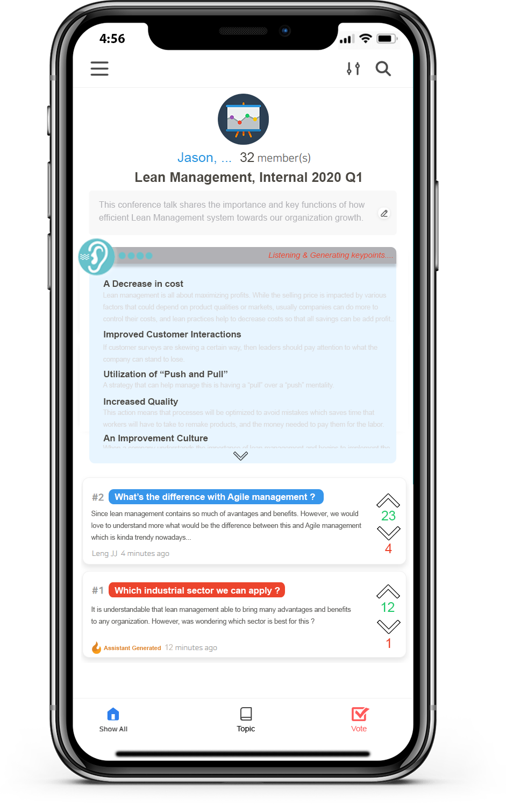
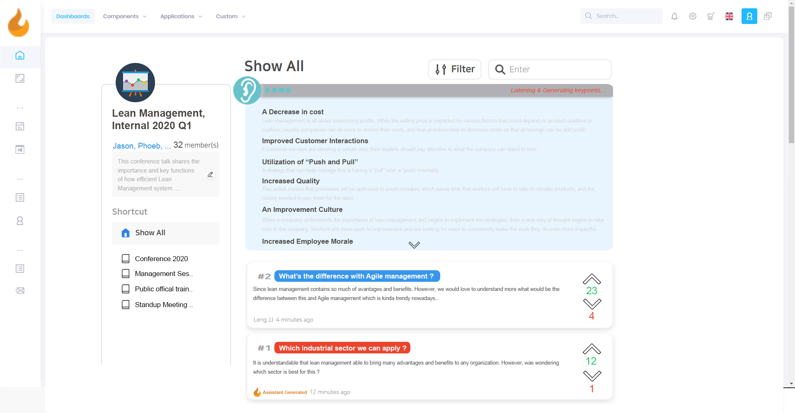
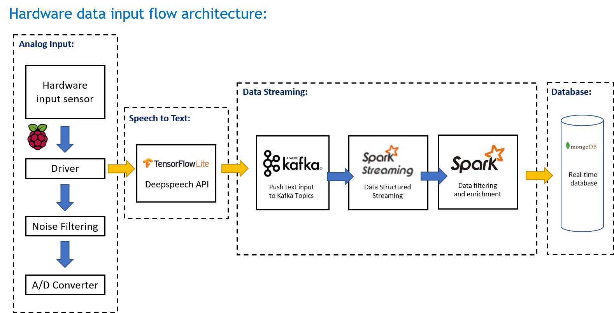
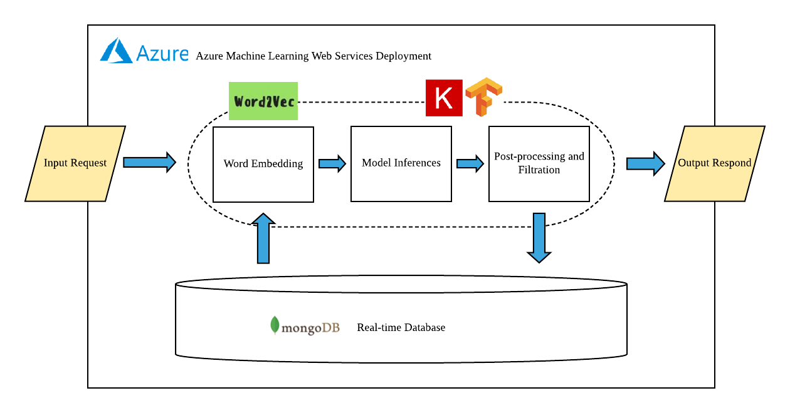
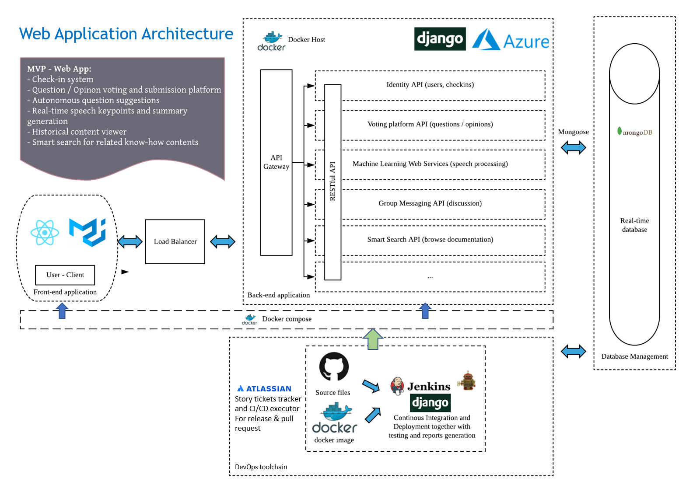

# Speech Smart Assistant
## Introduction
This is a smart Assistant that can interpret the speech content in real time and suggest useful questions, summarize relevant key points, creates questions voting platform, and others to allow employees to be always ready and even becoming an assistant in helping them to make better decisions and actions in the organization as well !

This repository is created to share the software architecture design for a complete stack of AI assistant application that involved embedded hardware app, web and mobile app, web services, and continuous integration developmenrt toolchains as well !

## Application sketchup & UI/UX mockup.
### Mobile View & application
 

### Desktop View & application

## Software Design Architecture
### Hardware input data stream design

### Azure ML Web Services

### Web Application & CI/CD Architecture Design

